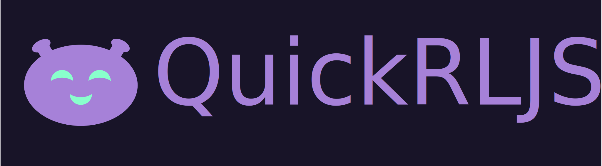

# QuickRLJS



The name of this Project might be a little deceiving. Is it quick? Well it depends. But it certainly is JS, right? Yeah also that is not entirely true. This library is programmed with TypeScript, but what certainly is not a lie is, that this is a Reinforcement Learning Librarie. Like many other libraries in mainly in other programming languages (a big inspiration was [OpenAIGym](https://github.com/openai/gym)) it tries to generalize reinforcement learning concepts. For this use case it offers an intuitive interface for reinforcement learning rnvironment as well as algorithms to be implemented. 

Have fun with this project.

## Usage

QuickRLJS can be used in the frontend as well as in the backend. I recommend training in node.js and then loading and using the model in the frontend.

### Example

First install the npm-package:

```bash
npm install quickrl.core
```

First create "training.ts" or how ever else you choose to call this file:

```ts
import { SingleAgentEnvironment, Agents, QuickRLJS } from 'quickrl.core';
// if you want to improve training performance, make shure you import this dependency
require('@tensorflow/tfjs-node-gpu');

// parameters
const randomSeed = 12;
const numTrainingEpisodes = 10000;
const logEvery = 500;
const maxIterationsPerGame = 25;

// load the environment
const env: SingleAgentEnvironment = <SingleAgentEnvironment>(
    QuickRLJS.loadEnv('BlackJack', { randomSeed: randomSeed })
);

// create an agent
const agent: Agents.DQNAgent = new Agents.DQNAgent(env, {
    learningRate: 0.0001,
    discountFactor: 0.99,
    nnLayer: [128, 128, 64],
    epsilonStart: 1,
    epsilonEnd: 0.01,
    epsilonDecaySteps: 10000,
    hiddenLayerActivation: 'relu',
    batchSize: 32,
    replayMemorySize: 10000,
    replayMemoryInitSize: 1000,
    activateDoubleDQN: true,
    updateTargetEvery: 10000,
});

// set and initialize the agent for the environment
env.agent = agent;
env.initAgent();

// train the agent
await env.train(numTrainingEpisodes, logEvery, maxIterationsPerGame);
```

### Saving Models

After you trained the model, these models can be saved. Depending on whether you train on the web or in a node.js environment you have to install the specific package. The following example will show how it is done in a node environment.

First install node `quickrl.node` package:

```bash
npm install quickrl.node
```

Now import the Filestrategies into your training script:

```ts
...
import { FileStrategies } from 'quickrl.node';
...
```

After the training was finished. The agent can be saved into a dedicated folder. Also make shure to save your settings so you don't lose them.

```ts
// train the agent
await env.train(numTrainingEpisodes, logEvery, maxIterationsPerGame);

await agent.save(
    new FileStrategies.NodeTFModelSaver({
        folderPath: './models/DQN/TaxiModel/',
    })
);
await agent.saveConfig(
    new FileStrategies.NodeJSONFileSaver({
        filePath: './models/DQN/TaxiModel/config.json',
    })
);
```

### Loading models

Previously saved models can also be loaded later. This way you can train the model, save it and load it at a later point in time to continue training, or you load trained models and can run benchmarks on them to analyse the results.

This is how you can load the model into a new agent for example:

```ts
const benchmarkAgent = new Agents.DQNAgent(env);

benchmarkAgent.loadConfig(
    new FileStrategies.NodeJSONFileLoader({
        filePath: './models/DQN/TaxiModel/config.json',
    })
);
benchmarkAgent.load(
    new FileStrategies.NodeTFModelLoader({
        folderPath: './models/DQN/TaxiModel/',
    })
);
```

## Links

- [To the API Documentation](https://philippoesch.github.io/QuickRLGym.js/docs/)

## Environments

- [x] BlackJack
- [x] Taxi Problem
- [ ] Grid World

## Algorithms

- [x] Monte Carlo
- [x] Q-Learning
- [x] Deep Q Learning
- [ ] Advantage Actor Critic
- [ ] Procimal Policy Optimization


